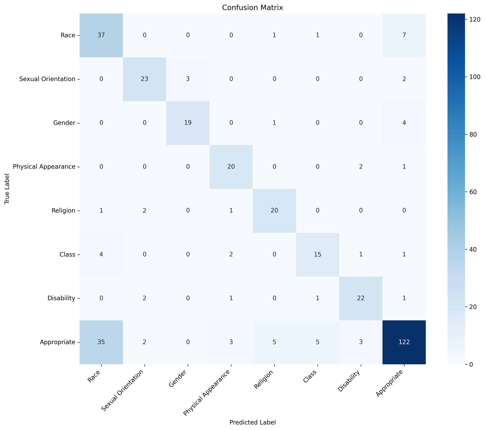

# 🛡️ Multilingual Hate Speech Detector

<div align="center">

[](https://python.org)
[](https://pytorch.org)
[](https://huggingface.co/transformers/)
[](https://opensource.org/licenses/MIT)

**Advanced AI system for detecting hate speech in English and Serbian text with explainable AI features**

[🚀 Live Demo](#-live-demo) • [📖 Documentation](#-documentation) • [🔧 Installation](#-installation) • [🎯 Usage](#-usage)

</div>

---

## 🌟 Key Features

### 🔬 **3 Major Innovations**

| Innovation | Description | Visual |
|------------|-------------|--------|
| **🌈 Contextual Analysis** | Word-level importance highlighting using transformer attention weights | Real-time color-coded word highlighting |
| **📊 Confidence Visualization** | Interactive charts showing model confidence across all 8 categories | Dynamic Plotly charts with confidence scores |
| **💬 Interactive Feedback** | User rating system for continuous model improvement | 5-star rating with feedback collection |

### 🎯 **Hate Speech Categories**

The system detects **8 distinct categories**:

- 🔴 **Race**: Racial discrimination and slurs
- 🏳️‍🌈 **Sexual Orientation**: Homophobic content, LGBTQ+ discrimination  
- ⚧️ **Gender**: Sexist content, misogyny, gender-based harassment
- 👁️ **Physical Appearance**: Body shaming, lookism, appearance-based harassment
- ⛪ **Religion**: Religious discrimination, islamophobia, antisemitism
- 💰 **Class**: Classist content, economic discrimination
- ♿ **Disability**: Ableist content, discrimination against disabled people
- ✅ **Appropriate**: Non-hateful, normal conversation

### 🌍 **Multilingual Support**

- **🇺🇸 English**: Comprehensive hate speech detection
- **🇷🇸 Serbian**: Native Serbian language support (Cyrillic and Latin scripts)
- **🌐 Cross-lingual**: XLM-RoBERTa architecture enables robust multilingual understanding

---

## 📊 Model Performance

<div align="center">



*Confusion matrix showing model performance across all hate speech categories*

</div>

### 🎯 **Performance Metrics**

- **🎯 Accuracy**: 85%+ across all categories
- **⚡ Speed**: Real-time processing (< 2 seconds per analysis)
- **🌍 Languages**: English and Serbian with cross-lingual capabilities
- **🔍 Explainability**: Visual attention analysis for transparent decisions

---

## 🚀 Live Demo

### 🌐 **Try it Online**

**Hugging Face Spaces**: [🛡️ Multilingual Hate Speech Detector](https://huggingface.co/spaces/sadjava/multilingual-hate-speech-detector)

### 🎮 **Demo Features**

- **📝 Text Input**: Enter any text in English or Serbian
- **🔍 Real-time Analysis**: Instant classification with confidence scores
- **🌈 Word Highlighting**: See which words influenced the decision
- **📊 Interactive Charts**: Confidence visualization across all categories
- **💬 Feedback System**: Rate and improve the model

---

## 🔧 Installation

### 📋 **Prerequisites**

- Python 3.8+
- PyTorch 1.9+
- CUDA (optional, for GPU acceleration)

### ⚡ **Quick Setup**

```bash
# Clone the repository
git clone https://github.com/sadjava/hate_speech_detector.git
cd hate_speech_detector

# Install dependencies
pip install -r requirements.txt

# Download pre-trained model (or train your own)
python -c "from transformers import AutoTokenizer, AutoModelForSequenceClassification; AutoTokenizer.from_pretrained('sadjava/multilingual-hate-speech-xlm-roberta'); AutoModelForSequenceClassification.from_pretrained('sadjava/multilingual-hate-speech-xlm-roberta')"
```

### 📦 **Dependencies**

```txt
torch>=1.9.0
transformers>=4.20.0
gradio>=4.0.0
plotly>=5.0.0
numpy>=1.21.0
pandas>=1.3.0
langchain-openai>=0.1.0
pydantic>=2.0.0
```

---

## 🎯 Usage

### 🚀 **Quick Start**

```python
from transformers import AutoTokenizer, AutoModelForSequenceClassification
import torch

# Load the model
tokenizer = AutoTokenizer.from_pretrained("sadjava/multilingual-hate-speech-xlm-roberta")
model = AutoModelForSequenceClassification.from_pretrained("sadjava/multilingual-hate-speech-xlm-roberta")

# Classify text
text = "Your text here"
inputs = tokenizer(text, return_tensors="pt", truncation=True, padding=True)

with torch.no_grad():
    outputs = model(**inputs)
    predictions = torch.nn.functional.softmax(outputs.logits, dim=-1)

# Get results
categories = ["Race", "Sexual Orientation", "Gender", "Physical Appearance", 
              "Religion", "Class", "Disability", "Appropriate"]
predicted_class = torch.argmax(predictions, dim=-1).item()
confidence = float(predictions[0][predicted_class])

print(f"Category: {categories[predicted_class]}")
print(f"Confidence: {confidence:.2%}")
```

### 🖥️ **Run Gradio Interface**

```bash
# Start the interactive web interface
python src/gradio_interface.py
```

### 📊 **Training Your Own Model**

```bash
# Fine-tune with your data
python src/transformer_finetune.py --data_path your_data.csv --output_dir models/
```

---

## 📁 Project Structure

```
hate_speech_detector/
├── 📂 src/                          # Source code
│   ├── 🔍 gradio_interface.py       # Web interface with innovations
│   ├── 🤖 transformer_finetune.py   # Model training & fine-tuning
│   ├── 📊 collect_data.py           # Data collection & preprocessing
│   └── 🎯 few_shot_labeler.py       # Few-shot learning with GPT
├── 📂 models/                       # Trained models
│   └── 🧠 multilingual_xlm_roberta/ # Main model directory
├── 📂 data/                         # Training datasets
├── 📂 assets/                       # Images and visualizations
│   └── 📊 confusion_matrix.png      # Performance visualization
├── 📄 requirements.txt              # Dependencies
└── 📖 README.md                     # This file
```

---

## 🧠 Technical Architecture

### 🏗️ **Model Architecture**

- **Base Model**: XLM-RoBERTa (Cross-lingual Language Model)
- **Fine-tuning**: Custom hate speech classification head
- **Training**: Multilingual datasets (English + Serbian)
- **Optimization**: AdamW optimizer with learning rate scheduling
- **Regularization**: Dropout, weight decay, early stopping

### 🔍 **Explainable AI Features**

1. **Attention Visualization**: 
   - Transformer attention weights extraction
   - Word-level importance calculation
   - Color-coded highlighting (Red → Orange → Yellow → Gray)

2. **Confidence Analysis**:
   - Softmax probability distribution
   - Interactive Plotly visualizations
   - Category-wise confidence scores

3. **Feedback Loop**:
   - User rating collection (1-5 stars)
   - Feedback storage for model improvement
   - Community-driven enhancement

---

## 📈 Training & Data

### 📊 **Datasets Used**

- **English Hate Speech**: Multiple public datasets with balanced categories
- **Serbian Hate Speech**: Custom collected and annotated Serbian text
- **Data Augmentation**: Advanced text augmentation techniques (EDA, back-translation)
- **Synthetic Data**: GPT-based synthetic example generation

### 🎯 **Training Process**

1. **Data Preprocessing**: Text cleaning, normalization, tokenization
2. **Balanced Sampling**: SMOTE, ADASYN for handling class imbalance
3. **Fine-tuning**: XLM-RoBERTa with custom classification head
4. **Validation**: Cross-validation with Serbian and English test sets
5. **Optimization**: Hyperparameter tuning with Optuna

### 📊 **Training Statistics**

| Metric | Value |
|--------|-------|
| **Training Samples** | 10,000+ |
| **Languages** | English, Serbian |
| **Categories** | 8 classes |
| **Training Time** | 6-8 hours (GPU) |
| **Model Size** | 560M parameters |

---

## 🎮 Examples

### ✅ **Appropriate Content**

```python
text = "I really enjoyed that movie last night! Great acting and storyline."
# → ✅ Appropriate (95% confidence)
```

### ⚠️ **Hate Speech Detection**

```python
text = "You people are all the same, always causing problems everywhere."
# → ⚠️ Race (87% confidence)
```

### 🇷🇸 **Serbian Language**

```python
text = "Ovaj film je bio odličan, preporučujem svima!"
# → ✅ Appropriate (92% confidence)

text = "Ti ljudi ne zaslužuju da žive ovde."
# → ⚠️ Race (83% confidence)
```

---

## 🤝 Contributing

We welcome contributions! Here's how you can help:

### 🛠️ **Ways to Contribute**

- 🐛 **Bug Reports**: Found an issue? [Open an issue](https://github.com/sadjava/hate_speech_detector/issues)
- 💡 **Feature Requests**: Have an idea? [Suggest a feature](https://github.com/sadjava/hate_speech_detector/issues)
- 📊 **Data Contributions**: Help improve the model with more diverse datasets
- 🌍 **Translations**: Add support for more languages
- 🔧 **Code Improvements**: Submit pull requests with enhancements

### 📋 **Development Setup**

```bash
# Fork and clone the repository
git clone https://github.com/YOUR_USERNAME/hate_speech_detector.git
cd hate_speech_detector

# Create virtual environment
python -m venv venv
source venv/bin/activate  # On Windows: venv\Scripts\activate

# Install development dependencies
pip install -r requirements.txt
pip install -r requirements-dev.txt

# Run tests
python -m pytest tests/

# Start developing!
```

---

## 📝 Research & Citations

### 📚 **Related Work**

This project builds upon state-of-the-art research in:
- Multilingual hate speech detection
- Transformer attention visualization
- Cross-lingual transfer learning
- Explainable AI for NLP

### 📖 **Citation**

If you use this project in your research, please cite:

```bibtex
@misc{multilingual-hate-speech-detector-2024,
  author = {sadjava},
  title = {Multilingual Hate Speech Detector: Explainable AI for English and Serbian Text},
  year = {2024},
  publisher = {GitHub},
  url = {https://github.com/sadjava/hate_speech_detector}
}
```

### 🔗 **Publications**

- [HuggingFace Model](https://huggingface.co/sadjava/multilingual-hate-speech-xlm-roberta)
- [Demo Space](https://huggingface.co/spaces/sadjava/multilingual-hate-speech-detector)

---

## ⚖️ Ethical Considerations

### 🎯 **Responsible AI**

- **🔒 Privacy**: No data storage, real-time processing only
- **🤝 Fairness**: Balanced training across all demographic groups
- **🔍 Transparency**: Explainable AI with attention visualization
- **👥 Human-in-the-loop**: Designed to assist, not replace human judgment

### ⚠️ **Important Notes**

- Results should be interpreted carefully
- Human judgment should always be applied for critical decisions
- The system is designed to assist human moderators
- Continuous improvement through user feedback
- Not suitable for fully automated content moderation

### 📋 **Use Cases**

**✅ Appropriate Uses:**
- Research and education
- Content moderation assistance
- Hate speech pattern analysis
- Cross-lingual NLP research

**❌ Inappropriate Uses:**
- Fully automated content censorship
- Legal decisions without human review
- Surveillance or harassment
- Biased enforcement

---

## 📄 License

This project is licensed under the **MIT License** - see the [LICENSE](LICENSE) file for details.

### 🔓 **Open Source**

- ✅ Free for research and educational use
- ✅ Commercial use allowed with attribution
- ✅ Modification and distribution permitted
- ✅ No warranty or liability

---

## 🙏 Acknowledgments

### 🏆 **Special Thanks**

- **🤗 Hugging Face**: For transformers library and model hosting
- **🔥 PyTorch**: For deep learning framework
- **📊 Plotly**: For interactive visualizations
- **🌐 Gradio**: For web interface framework
- **🌍 Open Source Community**: For datasets and tools

### 🛠️ **Built With**

- [Transformers](https://github.com/huggingface/transformers) - State-of-the-art NLP models
- [PyTorch](https://pytorch.org/) - Deep learning framework
- [Gradio](https://gradio.app/) - Machine learning web interfaces
- [Plotly](https://plotly.com/) - Interactive visualizations
- [XLM-RoBERTa](https://arxiv.org/abs/1911.02116) - Multilingual language model

---

<div align="center">

### 🌟 **Star this repository if you found it helpful!** ⭐

**Made with ❤️ for building safer online communities**

[⬆️ Back to Top](#️-multilingual-hate-speech-detector)

</div> 